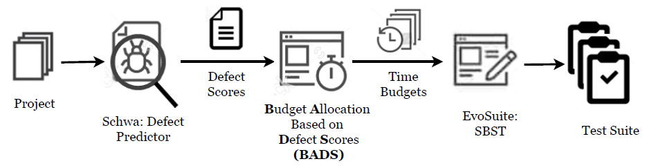

# SBST-DPG
Defect prediction guided search-based software testing (SBST-DPG) combines defect prediction and search-based software testing (SBST) to focus the test generation towards the defective classes in a project. SBST-DPG consists of three modules: i) Defect Predictor, ii) Budget Allocation Based on Defect Scores (BADS) and iii) SBST.

By default, SBST-DPG uses [Schwa](https://github.com/andrefreitas/schwa) as the defect predictor, which outputs the likelihoods of classes being defective (also called defect scores). 
Any defect predictor that outputs defect scores for the classes in the project would also be suitable for SBST-DPG.

BADS takes defect scores from the defect predictor and allocates time budgets to classes based on their likelihood of being defective.

We use [EvoSuite](https://github.com/EvoSuite/evosuite) with DynaMOSA as SBST and it runs test generation for all the classes with the allocated time budgets by BADS.

# How to use SBST-DPG?

Parameter Settings
------------

All the parameters of SBST-DPG are defined in [configs.yml]()

| Parameter                 | Description                                      | Default Value  | 
|---------------------------|--------------------------------------------------|---------------:|
| **Defect Predictor**               |                          |            | 
| name | Defect predictor name |      Schwa       |
| output_file | Output file name | schwa_results.csv |
| **BADS** |  |   |
| mode | BADS mode | exp |
| e_a | ***e**a*** + *e**b* . exp(*e**c* . *x*) | 0.02393705 |
| e_b | *e**a* + ***e**b*** . exp(*e**c* . *x*) | 0.9731946 |
| e_c | *e**a* + *e**b* . exp(***e**c*** . *x*) | -10.47408 |
| tier_threshold | Threshold used in 2-Tier approach | 0.5 |
| grouping | Small group size1 | 5p |
| t_total | Available time budget per class (seconds) | 60 |
| t_total_first_tier | Available time budget per class in the first tier (seconds) | 100 |
| t_total_second_tier | Available time budget per class in the second tier (seconds) | 20 |
| t_min_first_tier | Minimum time budget for a class in the first tier (seconds) | 60 |
| t_min_second_tier | Minimum time budget for a class in the second tier (seconds) | 10 |
| **SBST** |  |   |
| src_path | Filepath to the source files of the project under test | src/main/java |
| sbst | SBST tool | EvoSuite |
| project_classpath | Classpath of the project under test | target/classes |
| **Log** |  |   |
| primary_logger_type | Primary logger type | console |
| log_level | Log level | info |

1All the classes in a small group get the same time budget. If you need only one class in a small group, then use `1` for `grouping`. `5p` means small group size is 0.05 (=5%) * *# classes in the project*.
